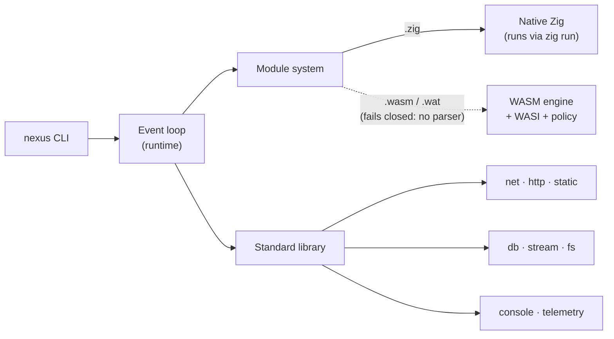

<div align="center">
  <h1>⚡ Nexus</h1>

  **A small, inspectable application runtime, written in Zig.**

  <p align="center">
    
    
    
    
  </p>
  <p align="center">
    
    
    
    
  </p>
</div>

---

> [!WARNING]
> **Nexus is experimental, pre-1.0 software under active development.**
> The runtime compiles against a single pinned Zig dev toolchain, public APIs
> are unstable, and several subsystems are scaffolding or partial
> implementations. It is **not production-ready** — in particular the custom
> TLS, ACME, WASM/WASI, gRPC, and QUIC/HTTP/3 paths are experimental and must
> not be trusted with real traffic or secrets. See the
> [capability status](#capability-status) matrix for what is actually usable.

## Overview

Nexus is an application runtime built around two ideas:

- **A Zig core** — a native event loop, module system, and standard library
  with no third-party dependencies and manual memory management. This is what
  works today: run `.zig` sources and serve HTTP.
- **WebAssembly as a planned execution target** — the engine, WASI, and
  capability-policy types are exported so callers can build against a stable
  surface, but there is no binary/`.wat` parser yet, so module instantiation
  **fails closed** (`error.WasmParsingUnsupported`). Running real `.wasm`
  modules end to end is not available in this release.

The goal is a small, inspectable runtime for HTTP services and, eventually,
polyglot (WASM) workloads. This repository is the reference implementation and
is still maturing — treat it as a foundation to build on and contribute to, not
a finished product.

## Capability status

Status reflects the current tree, not the long-term design goal.

### Exported public API — `@import("nexus")`

These namespaces are what the library actually exposes (see
[`src/root.zig`](src/root.zig)). Status is their maturity, not whether they
compile.

| Namespace | Status | Notes |
|-----------|--------|-------|
| `console` | 🟢 Working | Formatted logging helpers |
| `runtime` | 🟡 Partial | epoll event loop with readiness dispatch + a work-stealing scheduler (Chase–Lev deque), both unit-tested — including concurrent steal races and clean worker shutdown. kqueue mirrors the model; IOCP is completion-based and fails closed. Linux is the only exercised backend |
| `module` | 🟡 Partial | Zig/WASM resolution + content-addressed cache |
| `http` (server) | 🟡 Partial | Basic request/response; framing & router being hardened |
| `http.Client` | 🟡 Partial | Small-body requests |
| `middleware` | 🟡 Partial | Real `next()` chain (ordering/short-circuit reliable); feature set still growing |
| `static` | 🟡 Partial | Path confinement normalized component-wise (traversal rejected) |
| `fs` | 🟡 Partial | Mid-migration to the pinned `std.Io` model |
| `hot_reload` | 🟡 Partial | File watcher + reload manager backing `nexus dev` |
| `net` (TCP / WebSocket) | 🟠 Experimental | WebSocket handshake/frame validation incomplete |
| `stream` | 🟠 Experimental | Caller-owned callback context; concurrent pipes isolated |
| `wasm` (engine / WASI / policy) | 🟠 Experimental | **No binary/`.wat` parser** — `instantiate` fails closed; interpreter runs a raw MVP-opcode subset only; the policy is not a sandbox for hostile code |

The `nexus` **CLI** is 🟡 Partial: `run` (`.zig` only), `dev`, and `serve` are
real; `build` wraps `zig build`; `deploy`/`test` and `.wasm`/`.wat` fail closed
with a nonzero exit.

### In-tree, not exported — no support promise

These subsystems exist in the source and are unit-tested, but are deliberately
**left out** of the public surface (`root.zig` asserts their absence). Importing
them means reaching into internal files; treat them as planned, not shipped.

| Subsystem | Status | Notes |
|-----------|--------|-------|
| `db` (PostgreSQL / Redis) | 🔴 Gated out | Removed from the public surface, the build, and the test tree; does not compile under the pinned toolchain (NX-011) |
| `http2` | 🟠 Experimental | Framing/HPACK present; not interop-verified |
| QUIC / HTTP/3 | 🟠 Experimental | Scaffolding only |
| `grpc` | 🟠 Experimental | Not yet real HTTP/2 gRPC |
| GraphQL | 🟠 Experimental | Scope not finalized |
| OpenTelemetry | 🟠 Experimental | Console/log exporter only |
| ZIM package client (`pkg`) | 🟠 Experimental | Install/search/remove fail closed (`error.PackageOperationUnavailable`) until a real pipeline lands |
| TLS 1.2/1.3 | 🔴 Unsafe | Fails closed (no silent no-op), but peer verification is **not implemented** — `verify_peer` handshakes cannot complete |
| ACME / Let's Encrypt | 🔴 Unsafe | Finalize/download fail closed; issuance does not complete against a real CA |

**Removed this release:** the Wasmer-style compatibility layer and the
ownership-broken `wasm.load` wrapper (their absence is asserted by tests).

Legend: 🟢 working · 🟡 partial · 🟠 experimental · 🔴 experimental & unsafe.

## Quick start

Nexus builds against the **exact** pinned Zig dev toolchain declared in
[`build.zig.zon`](build.zig.zon) (`minimum_zig_version`). Other Zig versions
are not supported.

```bash
git clone https://github.com/ghostkellz/nexus.git
cd nexus
zig build                      # build the CLI + library
./zig-out/bin/nexus --version
```

Run a source file. Dispatch is by extension, but only `.zig` executes today —
`.wasm`/`.wat` fail closed with a nonzero exit because the engine has no
binary/`.wat` parser yet:

```bash
./zig-out/bin/nexus run examples/hello-world.zig   # compiled & run via `zig run`
./zig-out/bin/nexus dev 3000                        # watch src/ & examples/, hot reload on a port
```

A minimal HTTP handler:

```zig
const std = @import("std");
const nexus = @import("nexus");

pub fn main() !void {
    var gpa = std.heap.GeneralPurposeAllocator(.{}){};
    defer _ = gpa.deinit();

    var server = try nexus.http.Server.init(gpa.allocator(), .{
        .port = 3000,
        .host = "0.0.0.0",
    });
    defer server.deinit();

    try server.use(nexus.middleware.logger);
    try server.route("GET", "/", handle);
    try server.listen();
}

fn handle(req: *nexus.http.Request, res: *nexus.http.Response) !void {
    _ = req;
    try res.json(.{ .message = "Hello from Nexus" });
}
```

See [docs/getting-started/](docs/getting-started/) for installation,
configuration, and a longer walkthrough.

## Architecture



Three pillars:

- **Runtime** — event loop (epoll/kqueue/IOCP) + work-stealing scheduler.
- **Module system** — resolves and caches `.zig` and `.wasm` modules; WASM runs
  under a capability policy.
- **Standard library** — `http`, `net`, `static`, `stream`, `fs`, `db`,
  `console`, `middleware`, exported from [`src/root.zig`](src/root.zig).
  (`http2`, `grpc`, `pkg`, and the other in-tree subsystems are not exported —
  see [capability status](#capability-status).)

Full design, data flows, and per-subsystem diagrams live in
[docs/internals/architecture.md](docs/internals/architecture.md).

## Documentation

All documentation lives under [`docs/`](docs/README.md):

- [Getting started](docs/getting-started/) — install, build, configure.
- [Guides](docs/guides/) — HTTP, WebSocket, WASM modules, TLS/ACME, databases.
- [Reference](docs/reference/) — CLI and public API.
- [Internals](docs/internals/) — architecture, event loop, module & WASM design.
- [Advisories](docs/advisories/) — accepted risks and resolved issues.

## Contributing

Contributions are welcome — see [CONTRIBUTING.md](CONTRIBUTING.md) for the
workflow, formatting (`zig fmt`), and commit conventions. The current priorities
mirror the [capability status](#capability-status): completing the Zig 0.17
migration, memory/lifecycle safety, and closing the experimental security gaps.

## Security

Nexus is experimental and has known, documented security limitations (see the
[capability status](#capability-status) and [docs/advisories/](docs/advisories/)).
To report a vulnerability, follow [SECURITY.md](SECURITY.md) — please do not open
public issues for security reports.

## License

MIT — see [LICENSE](LICENSE). © CK Technology LLC.

---

<div align="center">
  <sub>Built with Zig ⚡ — a small runtime you can read end to end.</sub>
</div>
