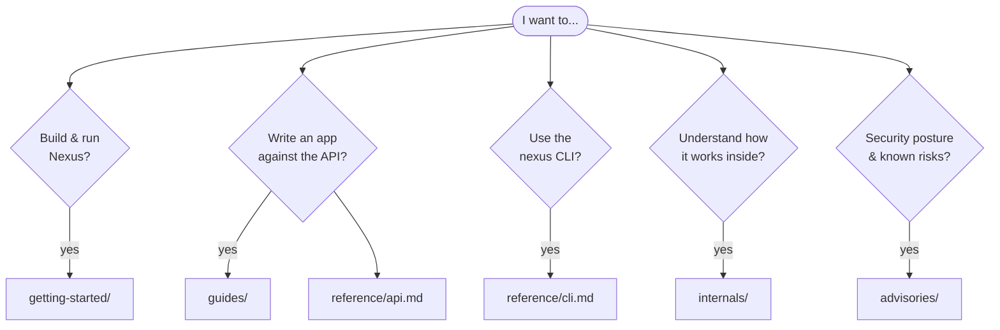
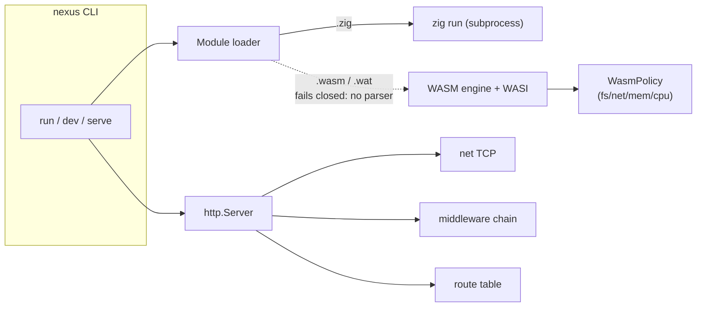

# Nexus Documentation

Documentation for **Nexus**, a small application runtime written in Zig (with a
capability-secured WebAssembly target that currently fails closed — no parser
yet). Nexus is **experimental, pre-1.0 software** — see the
[capability status](../README.md#capability-status) in the root README for what
is actually usable today, and [advisories](advisories/) for known limitations.

> Every subsystem in this documentation is annotated with its real status.
> Where a feature is a placeholder or unsafe, the docs say so.

## Documentation map

## Getting started

- [installation.md](getting-started/installation.md) — toolchain, cloning, and
  building from source.
- [quickstart.md](getting-started/quickstart.md) — your first HTTP server and
  running files with the CLI.
- [configuration.md](getting-started/configuration.md) — server config, ports,
  and project layout.

## Guides

Task-oriented how-tos for the standard library. Each notes its stability.

- [http-server.md](guides/http-server.md) — routing, requests, responses, JSON.
- [static-and-middleware.md](guides/static-and-middleware.md) — static files and
  the middleware chain.
- [websocket.md](guides/websocket.md) — WebSocket connections and rooms.
- [wasm-modules.md](guides/wasm-modules.md) — loading WASM under a policy.
- [databases.md](guides/databases.md) — PostgreSQL/Redis drivers (gated out, NX-011).
- [tls-and-acme.md](guides/tls-and-acme.md) — TLS and ACME (**experimental**;
  peer verification and issuance are unimplemented and fail closed).

## Reference

- [cli.md](reference/cli.md) — every `nexus` command and its real behavior.
- [api.md](reference/api.md) — the public modules exported from `src/root.zig`.

## Internals

- [architecture.md](internals/architecture.md) — system overview and key flows
  (diagrams).
- [event-loop.md](internals/event-loop.md) — the runtime event loop and timers.
- [module-system.md](internals/module-system.md) — resolution and caching.
- [wasm-runtime.md](internals/wasm-runtime.md) — WASM engine, WASI, and policy.

## Advisories

- [accepted.md](advisories/accepted.md) — known/accepted limitations and risks.
- [resolved.md](advisories/resolved.md) — issues that have been fixed.
- [triage.md](advisories/triage.md) — how security issues are triaged.

## Quick links

| Topic | Where |
|-------|-------|
| Public API surface | [`src/root.zig`](../src/root.zig) |
| Pinned Zig version | [`build.zig.zon`](../build.zig.zon) (`minimum_zig_version`) |
| Default HTTP port | `3000` (see [configuration.md](getting-started/configuration.md)) |
| Report a vulnerability | [SECURITY.md](../SECURITY.md) |
| Contributing | [CONTRIBUTING.md](../CONTRIBUTING.md) |

## Runtime shape

