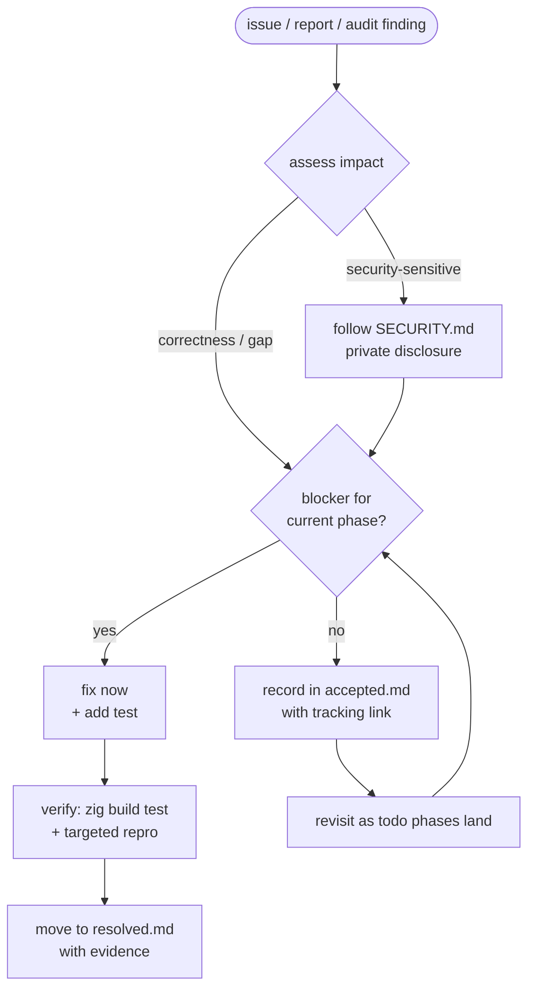

# Advisory triage

How security and correctness issues are triaged for Nexus while it is pre-1.0.



## Signals

- Build/compile failures against the pinned toolchain.
- Security reports (handled privately via [SECURITY.md](../../SECURITY.md) — do
  not open public issues for these).
- Correctness gaps found during ongoing internal code review.

## Checks

There is no third-party dependency surface (the `dependencies` table in
[`build.zig.zon`](../../build.zig.zon) is empty), so triage focuses on the code
itself rather than a package-audit tool. The baseline checks are:

```bash
zig fmt --check build.zig src tests examples benchmarks
zig build
zig build test
```

## Outcomes

- **Blocker for the current phase** → fix immediately, add a test, verify, and
  record in [resolved.md](resolved.md).
- **Known but deferred** → record in [accepted.md](accepted.md) with a severity
  and a short note on the remediation plan.
