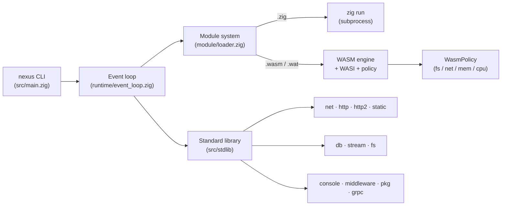
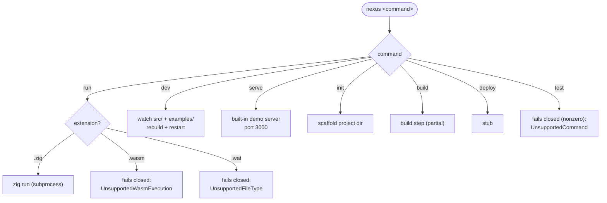
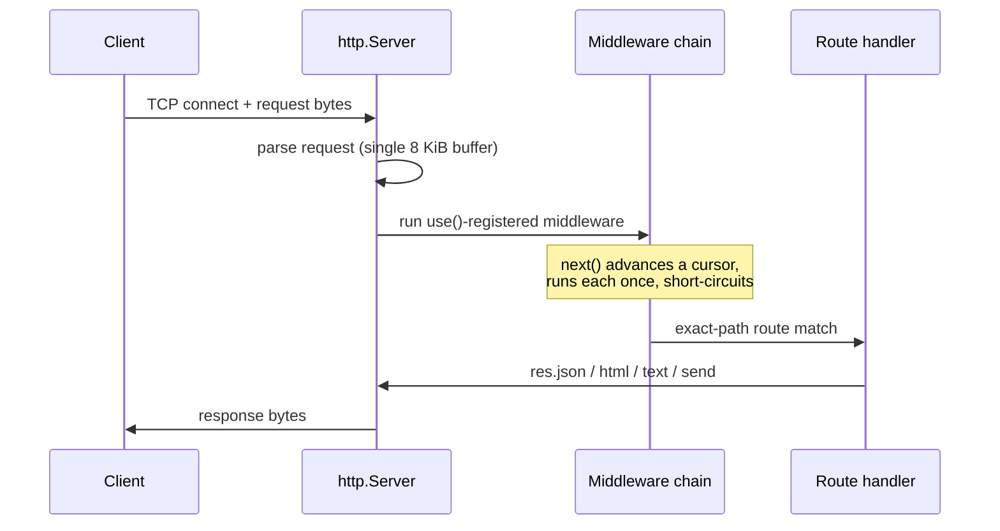
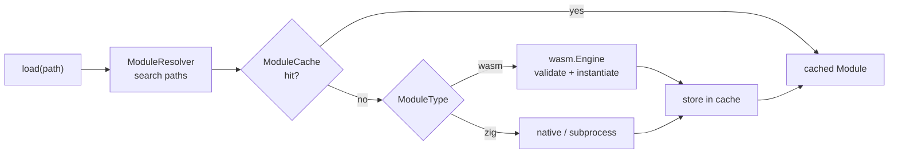

# Architecture

This describes how Nexus is structured today. It documents the **real** code
paths, including where a subsystem is scaffolding rather than a finished
implementation (see the [capability status](../README.md#capability-status)).

## System overview

Three pillars: the runtime (event loop + scheduler), the module system
(resolves/caches `.zig` and `.wasm`), and the standard library (HTTP, net, db,
etc.), all driven by the CLI.

## CLI dispatch

`nexus <command>` routes to a handler in [`src/main.zig`](../../src/main.zig).
`run` dispatches by file extension.

## HTTP request lifecycle

The HTTP server accepts a TCP connection, reads a single buffered request, runs
the middleware chain, matches a route by exact path, and writes the response.

> Known gaps in this flow: request framing beyond one buffer and path-parameter
> routing (exact-path only). The middleware `next()` now chains reliably (NX-005,
> [resolved](../advisories/resolved.md)). See
> [advisories/accepted.md](../advisories/accepted.md).

## Module resolution and execution

See [module-system.md](module-system.md) and [wasm-runtime.md](wasm-runtime.md).

## Source layout

| Path | Contents |
|------|----------|
| `src/main.zig` | CLI entry + command dispatch |
| `src/root.zig` | Public library API surface |
| `src/runtime/` | Event loop, timers, scheduler, hot reload |
| `src/module/` | Module resolution + cache |
| `src/wasm/` | Engine, interpreter, WASI, policy |
| `src/stdlib/net/` | http, http2, static, websocket, grpc, middleware, tcp |
| `src/stdlib/db/` | PostgreSQL, Redis (gated out of the surface/build/tests; do not compile — NX-011) |
| `src/stdlib/fs/` | File I/O (mid `std.Io` migration) |
| `src/stdlib/stream/` | Readable/Writable/Transform |
| `src/stdlib/console/` | Logging helpers |
| `src/stdlib/package/` | ZIM package client (operations fail closed pending a real pipeline) |

## Related

- [event-loop.md](event-loop.md) — the runtime core.
- [module-system.md](module-system.md) — resolution/caching.
- [wasm-runtime.md](wasm-runtime.md) — WASM engine, WASI, policy.
