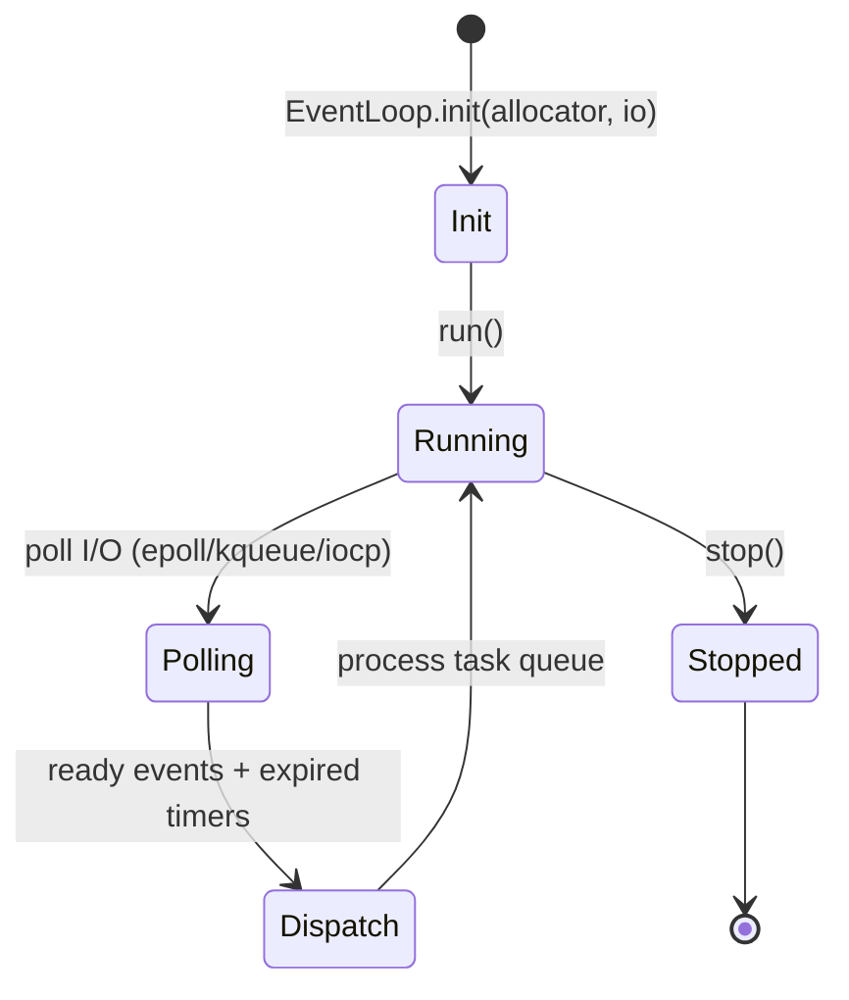

# Event loop

> **Status: 🟡 partial.** The event loop and timer machinery exist with
> platform pollers; I/O readiness dispatch is still being wired end-to-end. The
> work-stealing scheduler (Chase–Lev deque) needs multithreaded stress
> validation.

The runtime core is [`src/runtime/event_loop.zig`](../../src/runtime/event_loop.zig),
exported as `nexus.runtime` (and `nexus.EventLoop`).

## Components

| Type | Role |
|------|------|
| `EventLoop` | Owns the poller, timer heap, and task queue |
| `IoPoller` | Platform backend: `Epoll` (Linux), `Kqueue` (BSD/macOS), `Iocp` (Windows) |
| `TimerHeap` | Min-heap of timers for `setTimeout`/`setInterval` |
| `TaskQueue` | Ready tasks to run on the loop |
| `IoEvent` | Readiness flags: `READ`, `WRITE`, `ERROR`, `HANGUP` |
| `Timer`, `Task` | Handles returned to callers |

## Lifecycle



## Construction

```zig
var loop = try nexus.runtime.EventLoop.init(allocator, io);
defer loop.deinit();
```

`init` takes an allocator and an `std.Io`. The loop registers file descriptors
with the platform `IoPoller`, tracks timers in the `TimerHeap`, and drains the
`TaskQueue` each turn.

## Timers

| Method | Purpose |
|--------|---------|
| `setTimeout(cb, ms)` | Run `cb` once after a delay |
| `setInterval(cb, ms)` | Run `cb` repeatedly |
| `clearTimer(timer)` | Cancel a timer |

Internally the `TimerHeap` exposes `processExpired` and `nextTimeout`, which the
loop uses to compute its poll timeout.

## Poller backends

`IoPoller` is a tagged union chosen at build time for the target OS. Each backend
implements `init`, `register`, `unregister`, and `poll`. The readiness results
are translated into `IoEvent` flags and dispatched to the associated tasks.

> The dispatch path from poller readiness to per-connection continuations is the
> part still being completed.

## Related

- [architecture.md](architecture.md) — where the loop sits in the system.
