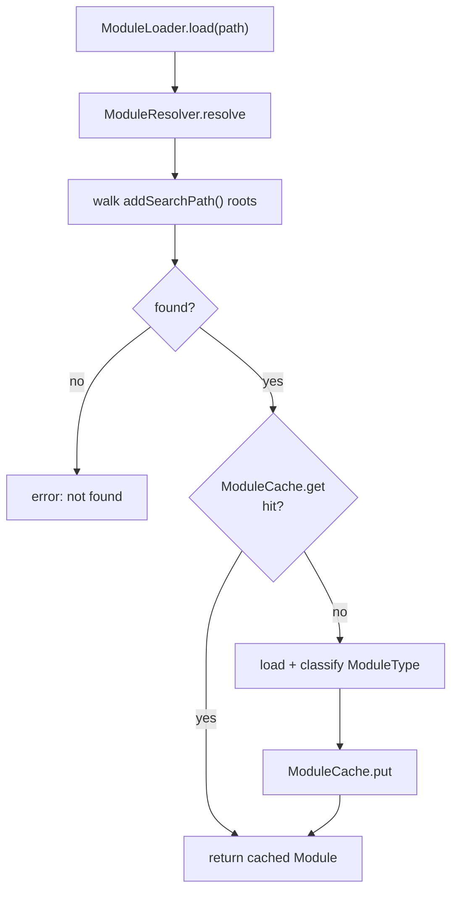

# Module system

> **Status: 🟡 partial.** Zig and WASM resolution plus a content-addressed cache
> exist. Execution wiring for each module type is at different maturity levels
> (Zig runs via subprocess; WASM via the experimental engine).

The loader is [`src/module/loader.zig`](../../src/module/loader.zig), exported as
`nexus.module`.

## Components

| Type | Role |
|------|------|
| `ModuleType` | Enum discriminating `.zig` / `.wasm` (and related) |
| `Module` | A resolved, loadable unit |
| `ModuleResolver` | Maps a request to a file via search paths |
| `ModuleCache` | Caches resolved modules |
| `ModuleLoader` | Ties resolution + cache + load together |

## Resolution flow

## Resolver

`ModuleResolver.addSearchPath(path)` registers a root; `resolve(name)` returns a
concrete path. The resolver is where import-style lookups are grounded to the
filesystem.

## Cache

`ModuleCache` provides `get`, `put`, and `remove`. Caching is content-addressed
so an unchanged module resolves to the same entry across loads.

## Execution by type

| Type | Path |
|------|------|
| `.zig` | Executed by spawning `zig run` as a subprocess (compiles against the local toolchain) |
| `.wasm` | Handed to `wasm.Engine` for validation + instantiation (experimental) |
| `.wat` | Reports that `wat2wasm` conversion is required first |

## Related

- [wasm-runtime.md](wasm-runtime.md) — what happens after a `.wasm` module resolves.
- [architecture.md](architecture.md) — module system in context.
