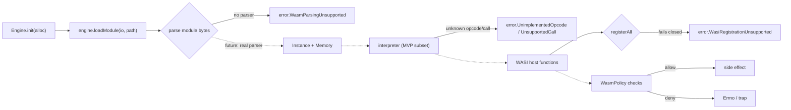
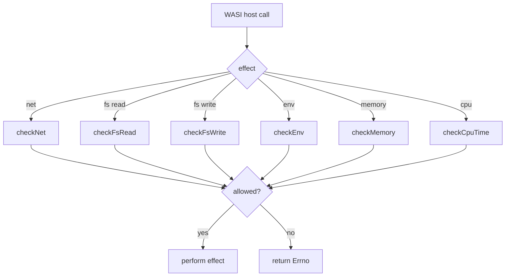

# WASM runtime

> **Status: 🟠 experimental — fails closed.** There is **no WASM binary/`.wat`
> parser**: `Module.instantiate` returns `error.WasmParsingUnsupported`, so no
> module file can be instantiated yet. The interpreter executes a raw MVP-opcode
> subset and **fails closed** on anything it does not implement
> (`error.UnimplementedOpcode`, `error.UnsupportedCall`) — it never logs-and-skips.
> WASI host-function registration also fails closed
> (`error.WasiRegistrationUnsupported`); the host-side arg/env/descriptor logic is
> implemented and tested but unreachable by a guest until a parser exists. The
> capability policy's path confinement is component-wise and rejects traversal.
> Do not run untrusted modules. See [advisories/accepted.md](../advisories/accepted.md)
> (NX-016, NX-017).

The WASM subsystem lives in `src/wasm/` (`engine.zig`, `interpreter.zig`,
`wasi.zig`, `policy.zig`), exported as `nexus.wasm`.

## Pipeline

Solid edges are today's fail-closed paths; dotted edges are the intended flow
once a binary parser and guest-reachable imports exist.

## Engine and interpreter

`Engine.loadModule` reads the file and builds a `Module`, but `Module.instantiate`
has **no parser** and returns `error.WasmParsingUnsupported` — no `Instance` is
produced from a module file. The interpreter can still execute a hand-supplied
buffer of raw MVP opcodes over a value stack of `Value`/`ValueType`.

> The interpreter **fails closed**: `.call` / `.call_indirect` return
> `error.UnsupportedCall` / `error.UnsupportedIndirectCall`, and the dispatch
> `else` returns `error.UnimplementedOpcode`. No opcode is silently skipped or
> logged-and-continued. A conformance + fail-closed test battery pins this
> (NX-006, [resolved](../advisories/resolved.md)).

## WASI preview1

`WasiContext` / `WasiHost` provide the host-function surface (`Errno`, `Rights`).
`registerAll` **fails closed** with `error.WasiRegistrationUnsupported` rather
than wiring fake imports. The host-side argv/environ serialization and
descriptor allocation (`allocFd` never aliases a live fd) are implemented and
unit-tested, but a guest cannot reach them until a parser and import wiring exist
(NX-016).

## Capability policy

Every host effect is meant to pass through `WasmPolicy`:

Policies are built with `restrictive` (deny by default), `permissive` (allow by
default), or `fromConfig` (a `PolicyConfig` of `FsPolicy` + `NetRule` + limits).

> **Path confinement:** `checkFsRead`/`checkFsWrite` normalize component-wise
> (`normalizeAbsolute`) and reject `..` traversal and prefix-sibling escapes; a
> regression test pins this (NX-003, [resolved](../advisories/resolved.md)).
> Confinement is still lexical (not `realpath`), so symlinks are not resolved,
> and no guest reaches these checks yet (no parser). The policy engine is **not**
> a sandbox for hostile code.

## Related

- [guides/wasm-modules.md](../guides/wasm-modules.md) — task-oriented usage.
- [module-system.md](module-system.md) — how a `.wasm` module is resolved.
